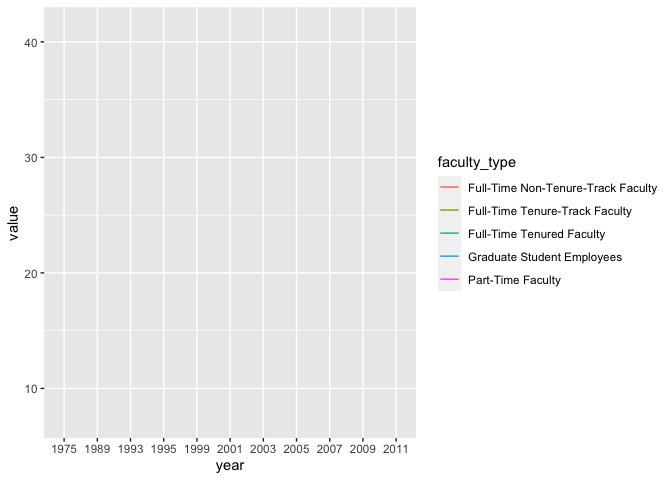
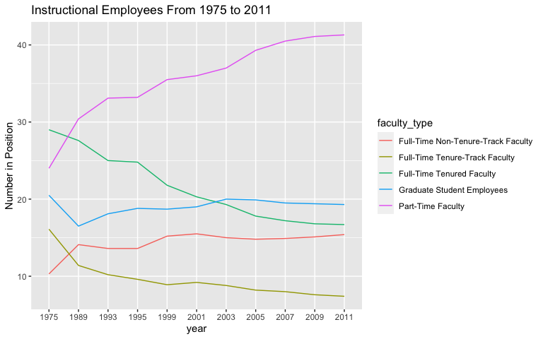
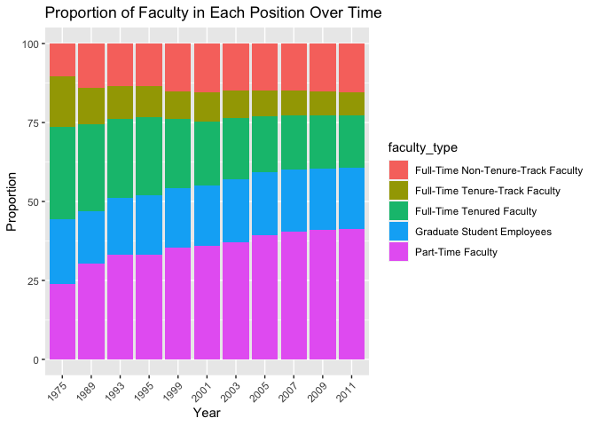
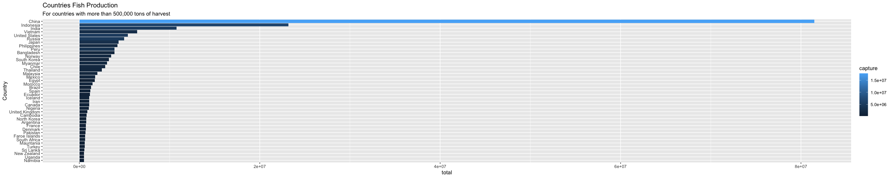
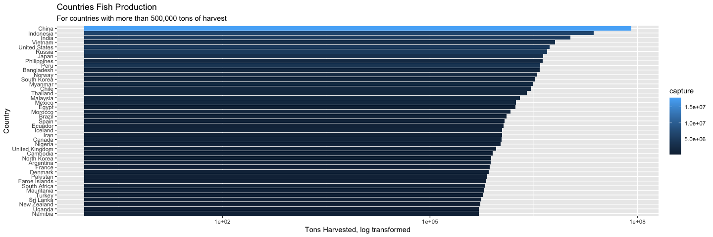
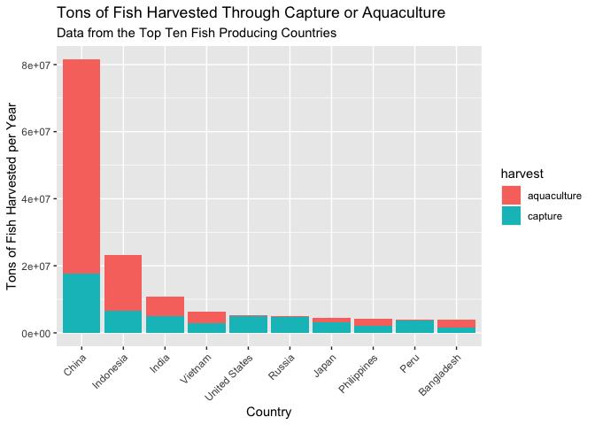
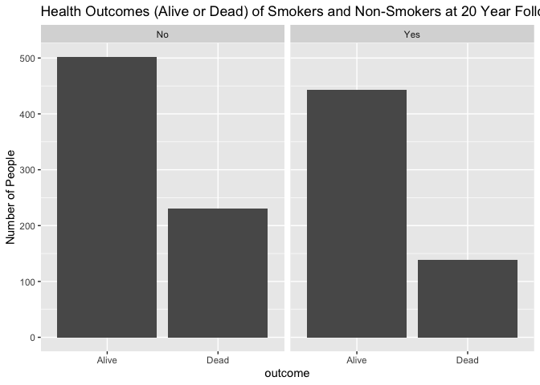
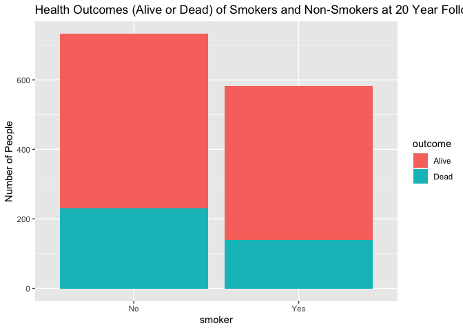
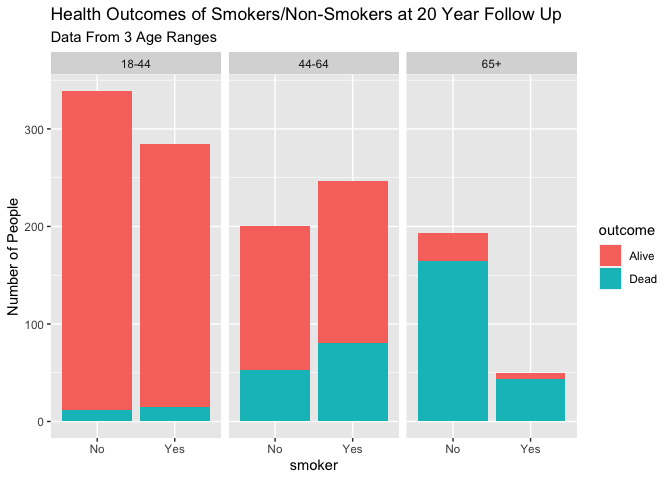

Lab 06 - Sad plots
================
Elayna Seago
2/22/22

### Load packages and data

``` r
library(tidyverse) 
library(dsbox) 
```

### Exercise 1

``` r
staff <- read_csv("data/instructional-staff.csv")
```

    ## Rows: 5 Columns: 12

    ## ── Column specification ────────────────────────────────────────────────────────
    ## Delimiter: ","
    ## chr  (1): faculty_type
    ## dbl (11): 1975, 1989, 1993, 1995, 1999, 2001, 2003, 2005, 2007, 2009, 2011

    ## 
    ## ℹ Use `spec()` to retrieve the full column specification for this data.
    ## ℹ Specify the column types or set `show_col_types = FALSE` to quiet this message.

``` r
staff_long <- staff %>%
  pivot_longer(cols = -faculty_type, names_to = "year") %>%
  mutate(value = as.numeric(value))

staff_long
```

    ## # A tibble: 55 × 3
    ##    faculty_type              year  value
    ##    <chr>                     <chr> <dbl>
    ##  1 Full-Time Tenured Faculty 1975   29  
    ##  2 Full-Time Tenured Faculty 1989   27.6
    ##  3 Full-Time Tenured Faculty 1993   25  
    ##  4 Full-Time Tenured Faculty 1995   24.8
    ##  5 Full-Time Tenured Faculty 1999   21.8
    ##  6 Full-Time Tenured Faculty 2001   20.3
    ##  7 Full-Time Tenured Faculty 2003   19.3
    ##  8 Full-Time Tenured Faculty 2005   17.8
    ##  9 Full-Time Tenured Faculty 2007   17.2
    ## 10 Full-Time Tenured Faculty 2009   16.8
    ## # … with 45 more rows

``` r
staff_long %>%
  ggplot(aes(x = year, y = value, color = faculty_type)) +
  geom_line()
```

    ## geom_path: Each group consists of only one observation. Do you need to adjust
    ## the group aesthetic?

<!-- -->



``` r
staff_long %>% 
  ggplot(aes(x = year, y = value , fill = faculty_type)) +
  geom_col() +
  theme(axis.text.x = element_text(angle = 45, vjust = 1, hjust=1))+
  labs(title = "Proportion of Faculty in Each Position Over Time" , y = "Proportion" , x = "Year")
```

<!-- -->

### Exercises 2

``` r
fisheries <- read_csv("data/fisheries.csv")
```

    ## Rows: 216 Columns: 4

    ## ── Column specification ────────────────────────────────────────────────────────
    ## Delimiter: ","
    ## chr (1): country
    ## dbl (3): capture, aquaculture, total

    ## 
    ## ℹ Use `spec()` to retrieve the full column specification for this data.
    ## ℹ Specify the column types or set `show_col_types = FALSE` to quiet this message.

``` r
fisheries
```

    ## # A tibble: 216 × 4
    ##    country             capture aquaculture  total
    ##    <chr>                 <dbl>       <dbl>  <dbl>
    ##  1 Afghanistan            1000        1200   2200
    ##  2 Albania                7886         950   8836
    ##  3 Algeria               95000        1361  96361
    ##  4 American Samoa         3047          20   3067
    ##  5 Andorra                   0           0      0
    ##  6 Angola               486490         655 487145
    ##  7 Antigua and Barbuda    3000          10   3010
    ##  8 Argentina            755226        3673 758899
    ##  9 Armenia                3758       16381  20139
    ## 10 Aruba                   142           0    142
    ## # … with 206 more rows

``` r
big_fisheries <- fisheries %>% 
  filter(total > 500000)

big_fisheries
```

    ## # A tibble: 41 × 4
    ##    country     capture aquaculture    total
    ##    <chr>         <dbl>       <dbl>    <dbl>
    ##  1 Argentina    755226        3673   758899
    ##  2 Bangladesh  1674770     2203554  3878324
    ##  3 Brazil       705000      581230  1286230
    ##  4 Cambodia     629950      172500   802450
    ##  5 Canada       874727      200765  1075492
    ##  6 Chile       1829238     1050117  2879355
    ##  7 China      17800000    63700000 81500000
    ##  8 Denmark      670344       36337   706681
    ##  9 Ecuador      715495      451090  1166585
    ## 10 Egypt        335614     1370660  1706274
    ## # … with 31 more rows

### ### For my first attempted improvement, I filtered the data to only include countries with more than 500,000 tons of harvest, made a bar plot, and flipped it sideways so all the names could be read.



### For my second attempted improvement I also did a log transformation of tons harvested.



### I dont really think either of these visualizations are that good. I think to make a better visualization I would need to think about what info I was trying to convey. I think a more interesting visualization would be a graph showing the breakdown of aquaculture vs capture in the 10 countries with the greatest fish harvest.

``` r
big_fisheries %>% 
  arrange(desc(total))
```

    ## # A tibble: 41 × 4
    ##    country        capture aquaculture    total
    ##    <chr>            <dbl>       <dbl>    <dbl>
    ##  1 China         17800000    63700000 81500000
    ##  2 Indonesia      6584419    16600000 23184419
    ##  3 India          5082332     5703002 10785334
    ##  4 Vietnam        2785940     3634531  6420471
    ##  5 United States  4931017      444369  5375386
    ##  6 Russia         4773413      173840  4947253
    ##  7 Japan          3275263     1067994  4343257
    ##  8 Philippines    2027992     2200914  4228906
    ##  9 Peru           3811802      100187  3911989
    ## 10 Bangladesh     1674770     2203554  3878324
    ## # … with 31 more rows

``` r
biggest_fisheries_total <- fisheries %>% 
  filter(total > 3800000)

biggest_fisheries_total %>% 
  arrange(desc(total))
```

    ## # A tibble: 10 × 4
    ##    country        capture aquaculture    total
    ##    <chr>            <dbl>       <dbl>    <dbl>
    ##  1 China         17800000    63700000 81500000
    ##  2 Indonesia      6584419    16600000 23184419
    ##  3 India          5082332     5703002 10785334
    ##  4 Vietnam        2785940     3634531  6420471
    ##  5 United States  4931017      444369  5375386
    ##  6 Russia         4773413      173840  4947253
    ##  7 Japan          3275263     1067994  4343257
    ##  8 Philippines    2027992     2200914  4228906
    ##  9 Peru           3811802      100187  3911989
    ## 10 Bangladesh     1674770     2203554  3878324

### Here I change to lots of different data frames because I didn’t think ahead to my final end goal

``` r
biggest_fisheries_total_long <- biggest_fisheries_total %>%
  pivot_longer(cols = -country, names_to = "harvest") %>%
  filter(harvest %in% c("capture" , "aquaculture")) %>% 
  mutate(value = as.numeric(value))

biggest_fisheries_total_long %>% 
  arrange(desc(value))
```

    ## # A tibble: 20 × 3
    ##    country       harvest        value
    ##    <chr>         <chr>          <dbl>
    ##  1 China         aquaculture 63700000
    ##  2 China         capture     17800000
    ##  3 Indonesia     aquaculture 16600000
    ##  4 Indonesia     capture      6584419
    ##  5 India         aquaculture  5703002
    ##  6 India         capture      5082332
    ##  7 United States capture      4931017
    ##  8 Russia        capture      4773413
    ##  9 Peru          capture      3811802
    ## 10 Vietnam       aquaculture  3634531
    ## 11 Japan         capture      3275263
    ## 12 Vietnam       capture      2785940
    ## 13 Bangladesh    aquaculture  2203554
    ## 14 Philippines   aquaculture  2200914
    ## 15 Philippines   capture      2027992
    ## 16 Bangladesh    capture      1674770
    ## 17 Japan         aquaculture  1067994
    ## 18 United States aquaculture   444369
    ## 19 Russia        aquaculture   173840
    ## 20 Peru          aquaculture   100187

``` r
biggest_fisheries_total_long %>% 
  ggplot(aes(x = reorder(country , -value) , y = value , fill = harvest)) +
  geom_bar(stat = "identity") +
  theme(axis.text.x = element_text(angle = 45, vjust = 1, hjust=1)) +
  labs(title = "Tons of Fish Harvested Through Capture or Aquaculture" , subtitle = "Data from the Top Ten Fish Producing Countries" , y = "Tons of Fish Harvested per Year" , x = "Country")
```

<!-- -->

### Exercise 3

``` r
library(mosaicData)
data(Whickham)
```

1.  These data come from an observational experiment.
2.  There are 1314 observations. Each represents a woman.
3.  There are 3 variables. Outcome status, smoker status, age.
4.  I would expect smoking to have a negative relationship with health
    outcome.

``` r
Whickham %>%
  count(smoker, outcome)
```

    ##   smoker outcome   n
    ## 1     No   Alive 502
    ## 2     No    Dead 230
    ## 3    Yes   Alive 443
    ## 4    Yes    Dead 139

``` r
Whickham %>% 
  ggplot(aes(x = outcome)) +
  geom_bar() +
  facet_wrap(~smoker)+
  labs(title = "Health Outcomes (Alive or Dead) of Smokers and Non-Smokers at 20 Year Follow Up" , y = "Number of People")
```

<!-- -->

``` r
Whickham %>% 
  ggplot(aes(x = smoker , fill = outcome)) +
  geom_bar()+
  labs(title = "Health Outcomes (Alive or Dead) of Smokers and Non-Smokers at 20 Year Follow Up" , y = "Number of People")
```

<!-- -->

5.  This graph and probability table shows that people who smoke are
    more likely to live for another 20 years compared to people who do
    not smoke. This does not support what I expected to see.

``` r
Whickham %>% 
  count(smoker , outcome) %>% 
  group_by(smoker) %>% 
  mutate(prop = n / sum(n))
```

    ## # A tibble: 4 × 4
    ## # Groups:   smoker [2]
    ##   smoker outcome     n  prop
    ##   <fct>  <fct>   <int> <dbl>
    ## 1 No     Alive     502 0.686
    ## 2 No     Dead      230 0.314
    ## 3 Yes    Alive     443 0.761
    ## 4 Yes    Dead      139 0.239

``` r
Whickham <- Whickham %>% 
  mutate(age_cat = case_when(
    age <= 44 ~"18-44" ,
    age > 44 & age <= 64 ~ "44-64" ,
    age > 64 ~ "65+"
  ))
```

``` r
Whickham %>% 
  ggplot(aes(x = smoker , fill = outcome)) +
  geom_bar()+
  labs(title = "Health Outcomes of Smokers/Non-Smokers at 20 Year Follow Up" , subtitle = "Data From 3 Age Ranges" , y = "Number of People")+
  facet_wrap(~age_cat)
```

<!-- -->

7.  This shows that in each age group, a higher proportion of people who
    are not smokers are alive 20 years later compared to the proportion
    of smokers who are alive 20 years later. This lines up with what I
    originally hypothesized and shows that age differences in those who
    smoke and do not smoke were a third variable that influenced the
    findings in the original graph and probability table.

``` r
Whickham %>%
  count(smoker, age_cat, outcome)%>% 
  group_by(smoker , age_cat) %>% 
  mutate(prop = n / sum(n)) 
```

    ## # A tibble: 12 × 5
    ## # Groups:   smoker, age_cat [6]
    ##    smoker age_cat outcome     n   prop
    ##    <fct>  <chr>   <fct>   <int>  <dbl>
    ##  1 No     18-44   Alive     327 0.965 
    ##  2 No     18-44   Dead       12 0.0354
    ##  3 No     44-64   Alive     147 0.735 
    ##  4 No     44-64   Dead       53 0.265 
    ##  5 No     65+     Alive      28 0.145 
    ##  6 No     65+     Dead      165 0.855 
    ##  7 Yes    18-44   Alive     270 0.947 
    ##  8 Yes    18-44   Dead       15 0.0526
    ##  9 Yes    44-64   Alive     167 0.676 
    ## 10 Yes    44-64   Dead       80 0.324 
    ## 11 Yes    65+     Alive       6 0.12  
    ## 12 Yes    65+     Dead       44 0.88
